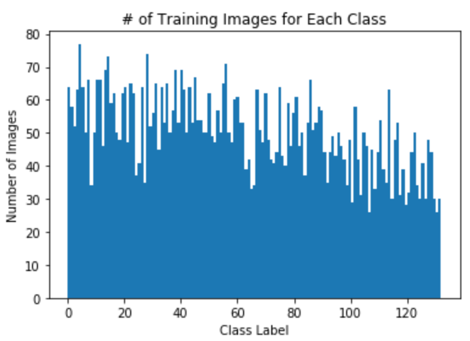
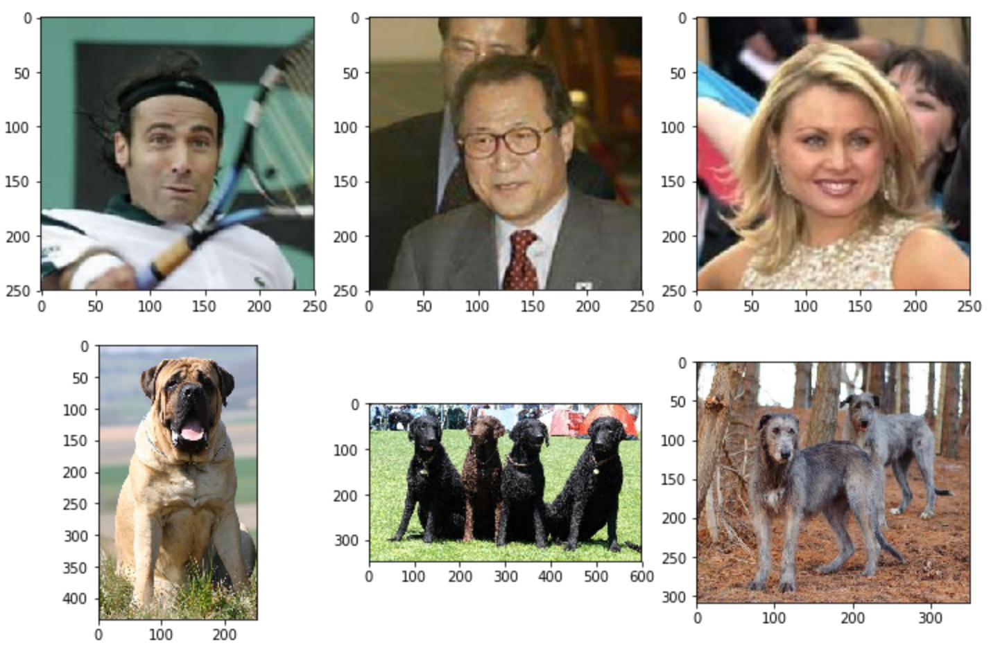
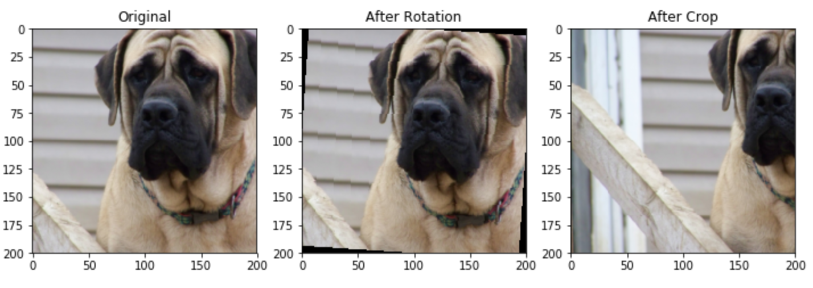
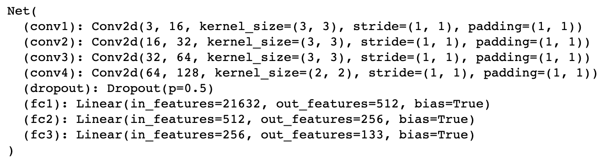
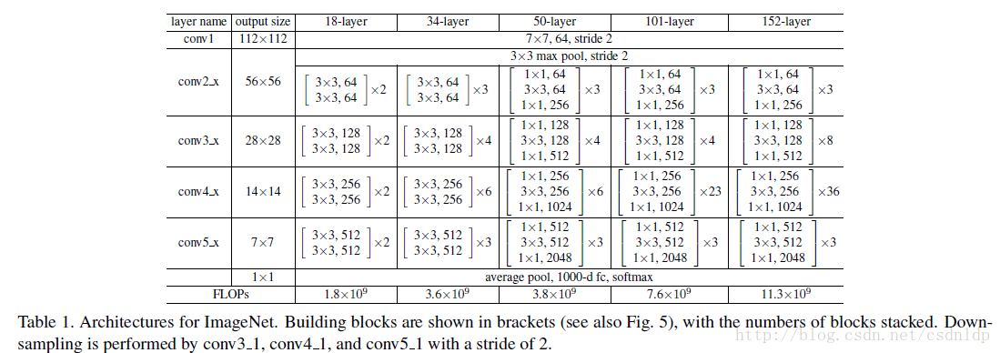

# Capstone Project: Dog Breed Classifer And A Web APP

## Udacity's Machine Learning Engineer Nanodegree

Chuan Zhang
July 4nd, 2021

## I. Definition

### Project Overview

Computer Vision has been one of the hottest machine learning topics in recent years. Compared with texts and numbers, pictures are more complex. Since every picture is formed by millions of pixels, it is much harder for a machine to figure out useful information. CNN, however, is a magic tool which has perfectly solved many problems in this field. The first CNN, the LeNet raised by LeCun in 1998[1](#refer), was designed to solve the classification task of written digits and got an excellent result despite the limit of computing capability at that time. After the "GPU Revolution" of computing capability, AlexNet by Alex Krizhevsky in 2012[2](#refer), is the first neural network that totally beat the performance of all other models in the ImageNet competition, which indicates the coming of a "CNN Era". Subsequently, many other updated models such as VGG[3], ResNet[4] and DenseNet[5] have dramatically increased the power of CNN.

In this project, I'd like to apply some of those excellent CNN models on a dog image dataset to figure out their breeds and then test the model. This model can be very useful in our daily life, especially under scenarios where automatic face detection is needed. This project was inspired by the [information and datasets](https://github.com/udacity/dog-project) that Udacity provided. 

### Problem Statement

Given a picture of a cute dog, sometimes I wonder what breed it is. But since I have very little knowledge of dogs, it might take a long time for me to find the answer. So is there a tool which can tell me the breed of a dog with just a glance? This is the problem I want to deal with here. Given the powerful deep learning models, the most common solution is to train a CNN classifier. I will design an algorithm to firstly figure out whether the input image contains a human or a dog; if it is a human picture, return the dog breed which resembles the human face most; if it is a dog picture, return the predicted breed; and if it is neither a human picture nor a dog picture, raise an error. And in the end, to make it more convenient for use, I will deploy it on a web app using Flask.

To be more specific, the tasks involved are the following:

* Step 0: Import Datasets
* Step 1: Detect Humans
* Step 2: Detect Dogs
* Step 3: Create a CNN to Classify Dog Breeds (from Scratch)
* Step 4: Create a CNN to Classify Dog Breeds (using Transfer Learning)
* Step 5: Write my Algorithm
* Step 6: Test my Algorithm
* Step 7: Design a Web App using Flask
* Step 8: Deploy the Model and Test

In Step 1, I will use OpenCV's implementation of Haar feature-based cascade classifiers -- here I use the 'haarcascade_frontalface_alt.xml' -- to detect the human faces.

In Step 2, I will use pretrained VGG-16 to detect the breed of the object in a picture.

In Step 3, I will train and test a self-designed CNN, which has been mentioned in Benchmark Model.

In Step 4, I will download the pretrained ResNet-18 first, and then finetune it on the training set. At the end of this part, test the performance.

In Step 5, I will write my own algorithm to realize the function of my app by combining the mentioned models.

In Step 6, I will test our algorithm on samples to evaluate it.

In Step 7, I will write an html template and design the webpage.

In Step 8, I will use Flask to deploy my model and run a web app. Finally, I can test my own out-of-sample pictures on the website!

### Metrics

My ultimate goal is to tell the right breed of dog or the most alike 'breed' of a human, and this is a multi-class problem, so accuracy is a good metric for this classifer. Accuracy is the percentage that the model gives correct predictions, or say
$$
Accuracy = \frac{True Possitive + True Negative}{Number \ of\ All Preditions}
$$
One another thing I have to concern when using the accuracy is whether there is sample imbalance in the training set. Luckily, as the following picture shows, the numbers of training samples in each class are uniformly distributed. Thus, there is no problem using accuracy as a metric.

 

  

    1.1 Size of Each Class in Traing Samples
  

  

## II. Analysis

### Data Exploration

In general, there are 13233 images in human images set and 8351 images in dog images set. The following are several samples randomly picked from human images set and dog images set. You may notice that in human set, their faces are clearly shown, so it is easy to tell which breed of dog mostly resembles their face; and in dog set, there might be more than one dog in a picture, which makes it more difficult to tell the breed, cause this requires our model to be less sensitive to the number. 

<bt>

2.1 Images from Human Set and Dog Set

### Exploratory Visualization

The plot which shows the size of each class in training samples has been put in 'Metrics'. Sample pictures and transformation samples will be discussed later. For the datasets have only pictures and classes, there is nothing more to explore.

### Algorithms and Techniques

As I have discussed in the first paragraph, Convolutional Neural Network (CNN) is a good solution to my problem. In my algorithm, I will first use two detectors to tell human faces, dog faces and no human nor dog faces. The human face detector will be a Haar feature-based cascade classifier implemented and pretrained by OpenCV. Then, the dog detector will be a pretrained VGG-16 model. After face detections, I will apply my own designed CNN or fine-tuned ResNet-18 model to predict breeds. But to find the optimal CNN model, there remains a lot of work to do. 

In general, CNN is a very complicated 'black box' whose quantity of parameters is unimaginably tremendous. To train such a model, I need to do additional preparation. Firstly, it requires a big training set, which I have applied data augmentation techniques to somehow meet. Besides I need to preprocess the input data to make different images comparable. As for huge amounts of computation, a powerful GPU is a must. Luckily, Udacity has provided one on its platform. 

Aside from training models, my project will also include deployment. With a simple html template, we will use Flask to create a web application and an API connecting the web app and our models. 

### Benchmark

Strictly speaking, there is no need for a benchmark in this project, since this project is more about application. However, I do have a comparison between the CNN model from scratch and CNN model from transfer learning. 

First of all, I will try to design a reasonable model architecture and train it to the best. Even though I have applied as many techniques as possible to improve its performance, for the lack of enough training data and for the limit of computation ability, the performance of this model is far from satisfactory, thus I need a very powerful methodology -- transfer learning. Finally, I will compare these two models and pick the better one for deployment.

## III. Methodology

### Data Preprocessing

The preprocessing mainly consists of the following steps:

1. Datasets are loaded and randomly split into a training set, a validation set and a test set.
2. The images are transformed.
3. Data augmentation methods are applied.
4. Datasets are encapsulated by dataloaders.

Before training, I will divide dog images into 3 subsets, 6680 for the training set, 835 for the validation set and 836 for the test set. By making data augmentation, the training set is expanded from 6680 to 20240 (6680 random rotation pictures and 6680 random crop pictures), which I will discuss later. 

Dog images now have various sizes, and dogs from the same breed may have different colors. As a result, I have to transform all images to make them comparable and this will also help to improve the generalization ability. Transformation methods I applied are listing here:

* Resizing: fix the width of each image to 255 pixels.
* Center Cropping: after resizing, apply a $200\times200$ center cropping to get the center square shaped segment of each picture;
* Normailzation: normalize all 3 channels (RGB) separately to reduce the influence of colours and the influence of outliers.  

As I have shown before in figure 1.1, there are 133 breeds in total among the dogs, and for each breed, I have 30-70 training images originally. For a computer vision problem, thousands of training samples, however, are far from enough. As for this, I have to apply some techniques to tackle the problem, and one way is to do data augmentation and another one way is to use transfer learning, which I will discuss later. 

Data Augmentation is a common technique when dealing with computer vision problems. Because I want to make my model a better generalization, I don't expect it to be sensitive to some tricky details, such as numbers, colors and facing directions of objects. As a result, I can add some small changes to our original training pictures, which will not only expand the training set without violating the embedding features, but also help to avoid overfitting.

The following is an example of how I made transformations on each image to create new training data. For rotation, I applied a random ten degree rotation; and for cropping, I applied a random $200\times200$ cropping.

  3.1 Data Augmentation Example
       

### Implementation

After data preprocessing, there are two main steps, model training and application development.

During the first step, our own-designed CNN will be trained first following the steps:

1. Load both training and validation sets into memory.
2. Define the network architecture, loss function and optimizer.
3. Write a train function to train the model and print the validate loss and accuracy after every epoch;
4. After each epoch, if the validate loss decreases, store the model parameters.
5. If the validate loss keeps increasing to 5% higher than the minimal validate loss, break the training process and return the model with the lowest validate loss.
6. If not satisfied, return to step 2.

Then I will train a CNN from transfer learning by the following steps:

1. Load a pretained CNN model from torch.models.
2. Adjust the output layer to 133 outputs.
3. Train the model on our training set. (The same as the stated training method.)

During the second step, I will 

1. design an HTML template first, which has several parts to be filled including the input image display board and the return sentence of our algorithm;
2. Then rewrite the data processing and inference to one file which will be connected to the app API later;
3. And finally use Flask to run a web server and provide an API to the model. 

### Refinement

When training CNN models, there are still things to be concerned. Optimizer and the loss function should be picked carefully. Adam optimizer is commonly chosen by most deep learning tasks, and I choose it as well. After several trials, I finally set the learning rate to 0.0005. I use the cross-entropy loss function in this project, which is the most classic choice for classification tasks. 

Besides, the architecture of my own-designed CNN and hyperparameters ought to be well designed. 

Architecture design includes:

1. Number of layers: to be discussed later;
2. Type of each layer: convolutional, pooling and fully-connected;
3. Activation function: all using Relu;
4. Methods to avoid overfitting: dropout.

Hyperparameters include:

1. Number of epochs: keep training until the validation loss after an epoch has increased more than 5% than the minimal validation loss after each epoch;
2. Batch size: 64, not too large to overwhelm the cache while not too small to decrease the  performance of stochastic gradient descent.

## IV. Results

### Model Evaluation and Validation

One thing I still need to have a deeper discussion about when selecting the model is the number of layers. At first, I used 2 convolutional layers, 2 pooling layers and 2 dense layers, but the validate accuracy was far less than 10%; to increase the prediction ability, I added convolutional and corresponding pooling layers to 4 pairs, and dense layers to 3. This time, the prediction performance was much better, but the model would overfit very quickly, after just 1 or 2 epochs. To enhance the generalization ability, I added a dropout layer, and this time the result is far better, with 12% test accuracy.

  
  
 4.1 CNN from Scratch 

When dealing with transfer learning, I applied fine-tuning, so the only thing I had to be concerned about was which model to use. For the dog detector I used a VGG-16 and I wanted to try something new, thus a ResNet-18 was used for this task. ResNet-18 is the simplest ResNet provided by torch.models, but it still has a huge amount of parameters and requires a very long time to train. Considering the limited ability of my GPU, this model is complicated enough for my GPU to train.

  
  
 4.2 ResNet 

Compared to my CNN from scratch, this CNN from transfer learning dramatically increased the test accuracy from 12% to 82%.

### Justification

The metric I am concerned about is the test accuracy. From this perspective, the second CNN model gives a test accuracy of 82%, which has hugely improved the test performance. But my ultimate goal is to have our trained model deployed and be useful, so testing the performance on the web app is quite necessary.

Inspiringly, this app works well too, as the examples I displayed later in the Conclusion part.

## V. Conclusion

### Free-Form Visualization

Let me show you how to operate it and give you some examples.

1. Firstly, choose a picture from local files.

  
Guide: Step 1

2. Then, click the 'submit' to upload the image and get the prediction.

  
Guide: Step 2

3. Finally, let's see some examples!

* Let me start with my own picture.

  

    

    
Example 2: Boy

  

* Dogue de bordeaux? Looks like a French name. I have never heard of this dog, but the name sounds cute, doesn't it? OK, let me google it... OMG! You sure??! 

  

    

  	
Dogue de bordeaux

  

* Then let's try a dog image! Obviously, our app works as expected and return the correct answer.

  

    

    
Example 3: Dog

  

* Until now, it works well (not perfect because I am absolutely smarter than that Dogue de bordeaux!). However, it doesn't work sometimes.

  

    

    
Example 4: Doge

  

* DogeCoin Fans: Doge is of course not dog! He is god \[\doge]! 

### Reflection

The purpose of this project is to explore the training and deployment of CNN models. Specifically speaking, I have developed the following steps:

1. Splited and transformed data;
2. Designed a simple CNN and trained it from scratch;
3. Fine-tuned a ResNet-18 on our training set (CNN from transfer learning);
4. Designed a html template and used Flask to create a web app;
5. Deployed the CNN from transfer learning model by connecting it to the web app.
6. Evaluated models and tested our app.

The most interesting part is step 6, where you can put any pictures you want into the application and get some very funny feedback.

The most difficult and tricky parts I found are step 2 and step 5. In step 2, it is very hard to say how can I get the best model architecture -- I have no metrics to evaluate my models until I have finished training it and get the validate performances, but training is always a time killer. So I had to read many articles and blogs to learn the experience from other experts, and tried their ideas many times until I got a relatively good result. In step 5, I was trapped by the model deployment. At first, the outputs of my original model and deployed model with the same input were different! I spent much time debugging and finally found it was because of the dropout layer, and when I reloaded my model, I would also need to tell the model that it should be in an evaluation mode. These experience obviously will help me to work better the next time I deal with a deep learning project.

### Improvement

Finetuned ResNet-18 performs well in this project, but there are still several ways that may improve the performance even better. As I mentioned before, for the limit of my device and time, I can only choose the 18 layers ResNet, while a deeper ResNet is very likely to perform better. If I have a more powerful device, like more than one GPUs, and I am given more time to train my model, of course I will choose a deeper one. 

Besides, fine-tuning is one of the simplest transfer learning methods. As I have learnt, there are still ways that may work:

1. Extract Feature Vector: Use pre-trained CNN as feature extractors, and redesign the classifer;

2. Domain-Adversarial Neural Network;

As for my app web, the user experience could also be improved by redesigning the UI and adding more functions. For example, if the model tells the input picture is of human, there can be a Siamese Network which is not only able to tell the most alike dog breed, but also able to give the most similar picture from local dog images provided during deployment.

### References

[1] [Lecun, Y. , and  L. Bottou . "Gradient-based learning applied to document recognition." Proceedings of the IEEE 86.11(1998):2278-2324.]
[2] [Krizhevsky, Alex, Ilya Sutskever, and Geoffrey E. Hinton. "Imagenet classification with deep convolutional neural networks." Advances in neural information processing systems 25 (2012): 1097-1105.]
[3] [Simonyan, Karen, and Andrew Zisserman. "Very deep convolutional networks for large-scale image recognition." arXiv preprint arXiv:1409.1556 (2014).]
[4] [He, Kaiming, et al. "Deep residual learning for image recognition." Proceedings of the IEEE conference on computer vision and pattern recognition. 2016.]
[5] [Huang, Gao, et al. "Densely connected convolutional networks." Proceedings of the IEEE conference on computer vision and pattern recognition. 2017.]
