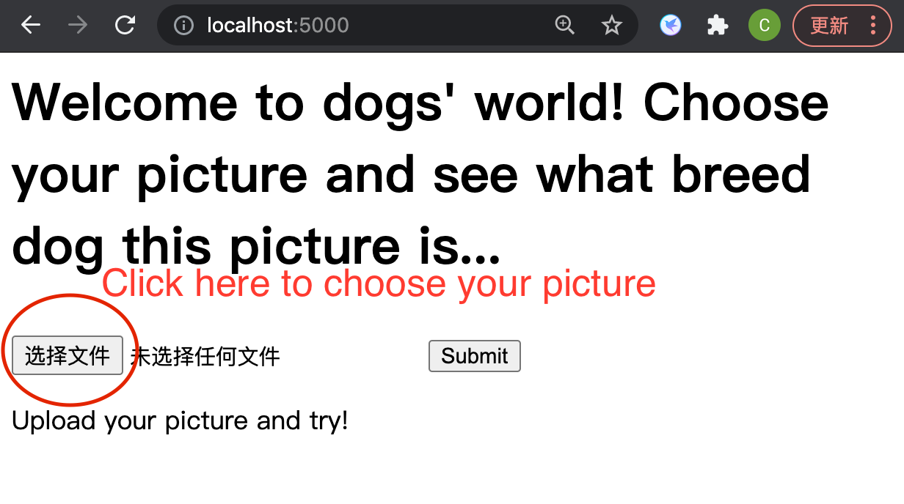
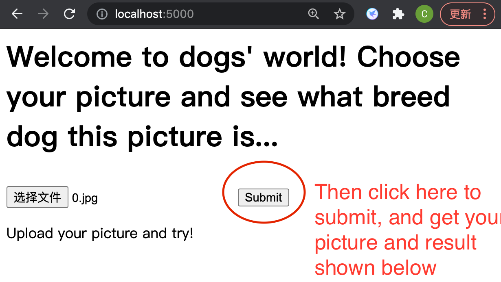
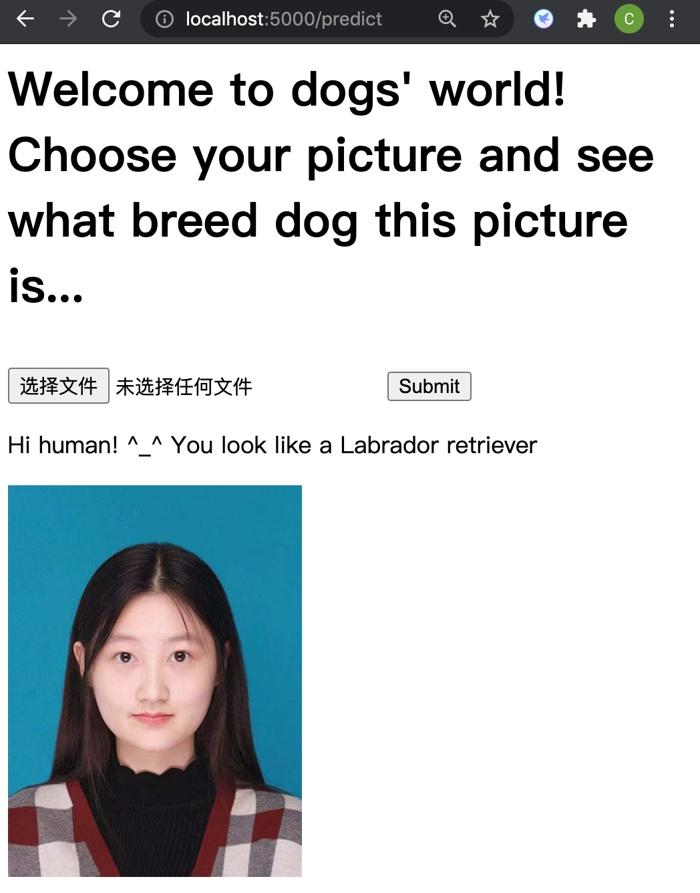
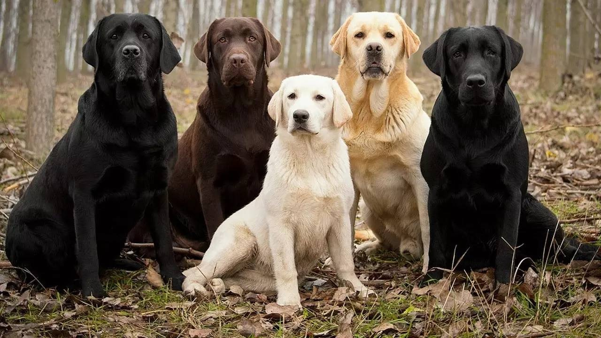
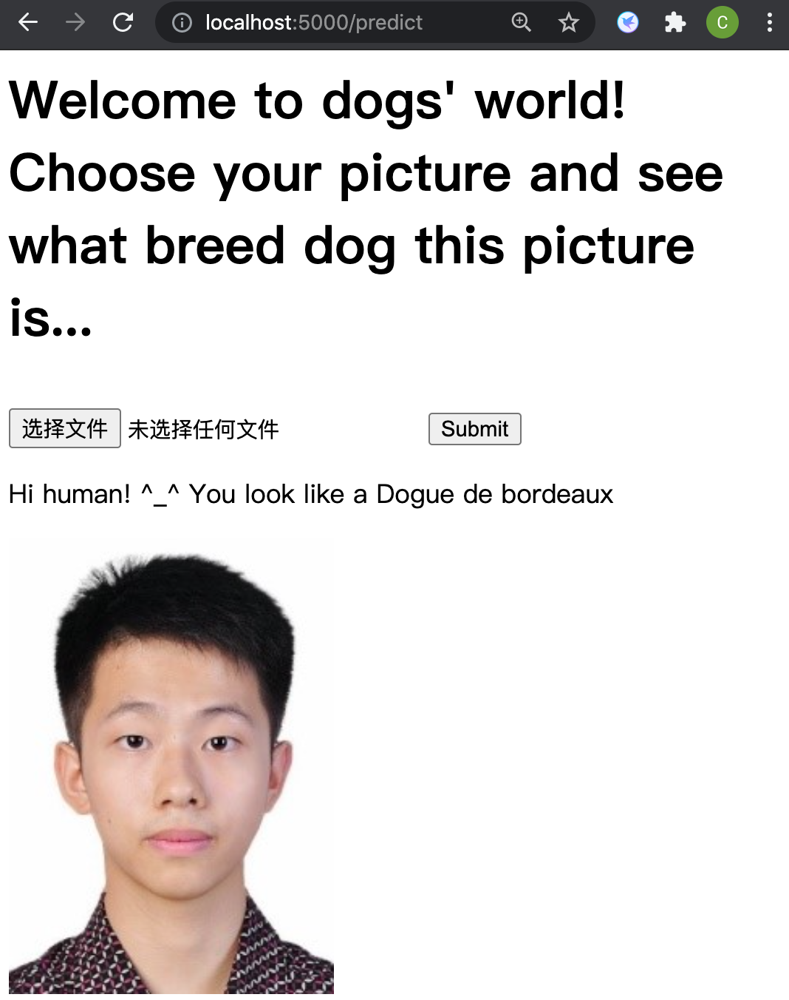
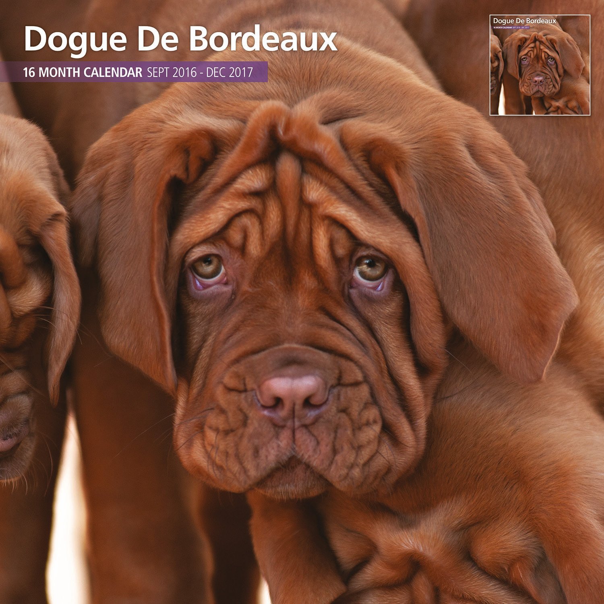
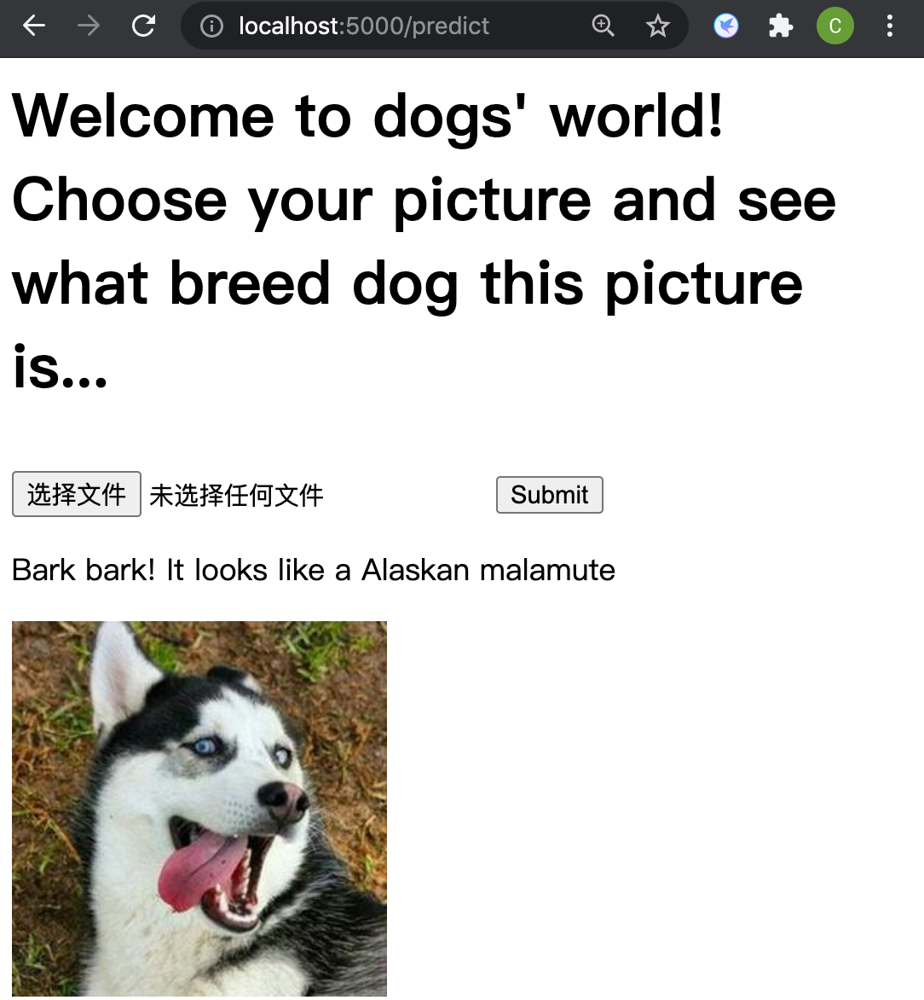
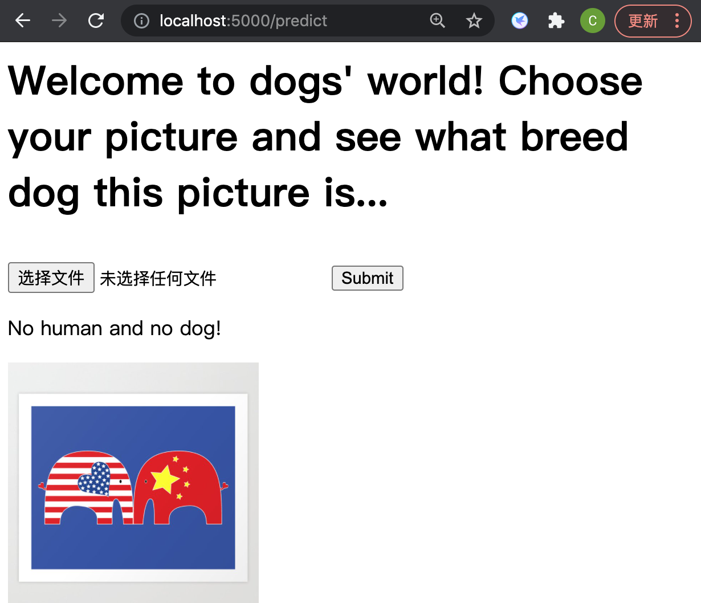

# Udacity-MLE-Nanodegree
Capston project for Udacity's Machine Learning Engineer Nanodegree

Chuan

July 2nd, 2021

### Project Overview

Computer Vision has been one of the hottest machine learning topics in recent years. Compared with texts and numbers, pictures are more complex. Since every picture is formed by millions of pixels, it is much harder for a machine to figure out useful information. CNN, however, is an magic tool which has perfectly solved many problems in this field. The first CNN, the LeNet raised by LeCun in 1998[1](#refer), was designed to solve the classification task of written digits and got an excellent result despite the limit of computing capability at that time. After the "GPU Revolution" of computing capability, AlexNet by Alex Krizhevsky in 2012[2](#refer), is the first neural network that totally beat the performance of all other models in the ImageNet competition, which indicates the coming of a "CNN Era". Subsequently, many other updated models such as VGG[3](#refer), ResNet[4](#refer) and DenseNet[5](#refer) have dramatically increased the power of CNN.

In this project, I'd like to apply some of those excellent CNN models on a dog image dataset to figure out their breeds and then test the model. This model can be very useful in our daily life, especially under scenarios that an automatical face detection is needed. This project was inspired by the [information and datasets](https://github.com/udacity/dog-project) that Udacity has provided. 

### Problem Statement

Given a picture of a cute dog, sometimes I will wonder what is the breed. But since I have very few knowledge of dogs, it is might take a long time for me to find the answer. So is there a tool which can tell me the breed of a dog with just a glance? This is the problem we want to deal with here. Given the powerful deep learning models, the most common solution is to train a CNN classifier. We will design an algorithm to firstly figure out whether the input image contains a human or a dog; if it is a human picture, return the dog breed which resembles the human face most; if it is a dog picture, return the predited breed; and if it is neither a human picture nor a dog picture, raise an error. And in the end, to make it more convinient for use, we will deploy it on a web app using Flask.

To be more specific, the tasks involved are the following:

* Step 0: Import Datasets
* Step 1: Detect Humans
* Step 2: Detect Dogs
* Step 3: Create a CNN to Classify Dog Breeds (from Scratch)
* Step 4: Create a CNN to Classify Dog Breeds (using Transfer Learning)
* Step 5: Write my Algorithm
* Step 6: Test my Algorithm
* Step 7: Design a Web App using Flask
* Step 8: Deploy the Model and Test

In Step 1, we will use OpenCV's implementation of Haar feature-based cascade classifiers -- here we use the 'haarcascade_frontalface_alt.xml' -- to detect the human faces.

In Step 2, we will use pretrained VGG-16 to detect the breed of the object in a picture.

In Step 3, we train and test a self-desiged CNN, which has been mentioned in Benchmark Model.

In Step 4, we download the pretrained ResNet-18 first, and then finetune it on our training set. At the end of this part, test the performance.

In Step 5, we write our own algorithm to realize the function of our app by combining the mentioned models.

In Step 6, we test our algorithm on the samples to make sure it works well.

In Step 7, we write a html template and design our webpage.

In Step 8, we use Flask to deploy our model and run a web app. Finally, we can test our own out-of-sample pictures on the website!

### Project Overview

Computer Vision has been one of the hottest machine learning topics in recent years. Compared with texts and numbers, pictures are more complex. Since every picture is formed by millions of pixels, it is much harder for a machine to figure out useful information. CNN, however, is an magic tool which has perfectly solved many problems in this field. The first CNN, the LeNet raised by LeCun in 1998[1](#refer), was designed to solve the classification task of written digits and got an excellent result despite the limit of computing capability at that time. After the "GPU Revolution" of computing capability, AlexNet by Alex Krizhevsky in 2012[2](#refer), is the first neural network that totally beat the performance of all other models in the ImageNet competition, which indicates the coming of a "CNN Era". Subsequently, many other updated models such as VGG[3], ResNet[4] and DenseNet[5] have dramatically increased the power of CNN.

In this project, I'd like to apply some of those excellent CNN models on a dog image dataset to figure out their breeds and then test the model. This model can be very useful in our daily life, especially under scenarios that an automatical face detection is needed. This project was inspired by the [information and datasets](https://github.com/udacity/dog-project) that Udacity has provided. 

### Problem Statement

Given a picture of a cute dog, sometimes I will wonder what is the breed. But since I have very few knowledge of dogs, it is might take a long time for me to find the answer. So is there a tool which can tell me the breed of a dog with just a glance? This is the problem we want to deal with here. Given the powerful deep learning models, the most common solution is to train a CNN classifier. We will design an algorithm to firstly figure out whether the input image contains a human or a dog; if it is a human picture, return the dog breed which resembles the human face most; if it is a dog picture, return the predited breed; and if it is neither a human picture nor a dog picture, raise an error. And in the end, to make it more convinient for use, we will deploy it on a web app using Flask.

To be more specific, the tasks involved are the following:

* Step 0: Import Datasets
* Step 1: Detect Humans
* Step 2: Detect Dogs
* Step 3: Create a CNN to Classify Dog Breeds (from Scratch)
* Step 4: Create a CNN to Classify Dog Breeds (using Transfer Learning)
* Step 5: Write my Algorithm
* Step 6: Test my Algorithm
* Step 7: Design a Web App using Flask
* Step 8: Deploy the Model and Test

In Step 1, we will use OpenCV's implementation of Haar feature-based cascade classifiers -- here we use the 'haarcascade_frontalface_alt.xml' -- to detect the human faces.

In Step 2, we will use pretrained VGG-16 to detect the breed of the object in a picture.

In Step 3, we train and test a self-desiged CNN, which has been mentioned in Benchmark Model.

In Step 4, we download the pretrained ResNet-18 first, and then finetune it on our training set. At the end of this part, test the performance.

In Step 5, we write our own algorithm to realize the function of our app by combining the mentioned models.

In Step 6, we test our algorithm on the samples to make sure it works well.

In Step 7, we write a html template and design our webpage.

In Step 8, we use Flask to deploy our model and run a web app. Finally, we can test our own out-of-sample pictures on the website!

### Web App

We built a simple website to display our app. Let me show you how to operate it and give you some examples.

* Firstly, choose a picture from local files.

  
Guide: Step 1

* Then, click the 'submit' to upload the image and get the prediction.

  
Guide: Step 2

* Finally, let's see some examples!

  * Let's secretly put my girlfriend's picture in as an experiment! Don't tell her please!

    

      

      
Example 1: Girl

    	

    	
Labrador retriver

    

  * Wow, cut Labrador! Seems work well. Then, I think it is time to put my own photo in.

    

      

      
Example 2: Boy

    

  * Dogue de bordeaux? Looks like a French name. I have never heard of this dog, but the name sounds cute, doesn't it? OK, let me google it... OMG! You sure??! 

    

      

    	
Dogue de bordeaux

    

  * I think there are enough humans, so let's try a dog image!

    

      

      
Example 3: Dog

    

  * Until now, it works well (not perfect because I am absolutely smarter than that Dogue de bordeaux!). However, it doesn't want to work sometimes...

    

      

      
Example 4: Doge

    

  * DogeCoin Fans: Doge is of course not dog! He is god \[\doge]! (End)

### References

[1] [Lecun, Y. , and  L. Bottou . "Gradient-based learning applied to document recognition." Proceedings of the IEEE 86.11(1998):2278-2324.]

[2] [Krizhevsky, Alex, Ilya Sutskever, and Geoffrey E. Hinton. "Imagenet classification with deep convolutional neural networks." Advances in neural information processing systems 25 (2012): 1097-1105.]

[3] [Simonyan, Karen, and Andrew Zisserman. "Very deep convolutional networks for large-scale image recognition." arXiv preprint arXiv:1409.1556 (2014).]

[4] [He, Kaiming, et al. "Deep residual learning for image recognition." Proceedings of the IEEE conference on computer vision and pattern recognition. 2016.]

[5] [Huang, Gao, et al. "Densely connected convolutional networks." Proceedings of the IEEE conference on computer vision and pattern recognition. 2017.]
