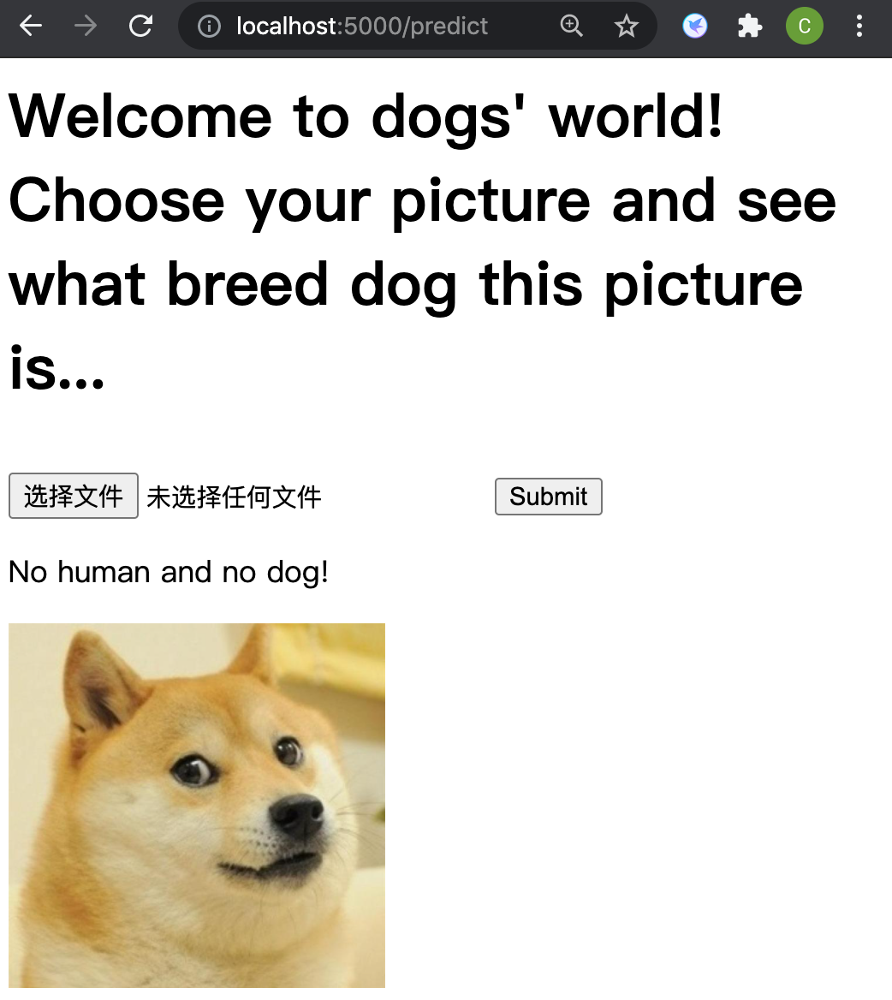

# Machine Learning Engineer Nanodegree
## Capstone Proposal
Chuan Zhang
June 26th, 2021

## Proposal
CNN Project: Dog Breed Classifier (One of 3 capstone candidate projects that Udacity offers)

### Domain Background
Computer Vision has been one of the hottest machine learning topics in recent years. Compared with texts and numbers, pictures are more complex. Since every picture is formed by millions of pixels, it is much harder for a machine to figure out useful information. CNN, however, is an magic tool which has perfectly solved many problems in this field. The first CNN, the LeNet raised by LeCun in 1998[1](#refer), was designed to solve the classification task of written digits and got an excellent result despite the limit of computing capability at that time. After the "GPU Revolution" of computing capability, AlexNet by Alex Krizhevsky in 2012[2](#refer), is the first neural network that totally beat the performance of all other models in the ImageNet competition, which indicates the coming of a "CNN Era". Subsequently, many other updated models such as VGG[3](#refer), ResNet[4](#refer) and DenseNet[5](#refer) have dramatically increased the power of CNN.

In this project, I'd like to apply some of those excellent CNN models on a dog image dataset to figure out their breeds and then test the model. This model can be very useful in our daily life, especially under scenarios that an automatical face detection is needed. 

### Problem Statement

Given a picture of a cute dog, sometimes I will wonder what is the breed. But since I have very few knowledge of dogs, it is might take a long time for me to find the answer. So is there a tool which can tell me the breed of a dog with just a glance? This is the problem I want to deal with here. Given the powerful deep learning models, the most common solution is to train a CNN classifier. The expected result is that this model can firstly tell which are human faces and which are dog faces; if it is a human face, figure out what breed this man/woman most resembles; and if it a dog face, figure out the breed concisely. And in the end, to make it more convinient for use, I will try to deploy it on a web app using Flask.

### Datasets and Inputs

The datasets are provided by Udacity for this capstone project. 

In general, there are 13233 images in human images set and 8351 images in dog images set. For training, we will divide dog images into 3 subsets, 6680 for the training set, 835 for the validate set and 836 for the test set. There are totally 133 breeds among the dogs.

By making data augmentation (rotation and random crop), we expand the training set from 6680 to 20240.

### Solution Statement

In this project, we will design an algorithm to firstly figure out whether the input image contains a human or a dog; if it is a human picture, return the dog breed which resembles the human face most; if it is a dog picture, return the predited breed; and if it is neither a human picture nor a dog picture, raise an error.

### Benchmark Model

I will firstly design and train a scratch CNN model, and use this as a benchmark; then I will finetune from a pretrained ResNet-18, and compare the results.

The benchmark scratch model will have structure as the following:

(200, 200, 3) -> CNN1 -> (200,200,16) -> MaxPooling -> (100,100,16) -> CNN2 -> (100,100,32) -> MaxPooling -> (50,50,32) -> Dropout(0.5) -> CNN3 -> (50,50,64) -> MaxPooling -> (25,25,64) -> CNN4 -> (26,26,128) -> MaxPooling -> (13,13,128) -> Dropout(0.5) -> Dense1 -> 512 -> Dense2 -> 256 -> Dense3 -> 133

### Evaluation Metrics

We use the test accuracy to evaluate the performance.

### Project Design

Generally, there will be several steps:

* Step 0: Import Datasets
* Step 1: Detect Humans
* Step 2: Detect Dogs
* Step 3: Create a CNN to Classify Dog Breeds (from Scratch)
* Step 4: Create a CNN to Classify Dog Breeds (using Transfer Learning)
* Step 5: Write my Algorithm
* Step 6: Test my Algorithm
* Step 7: Design a Web App using Flask
* Step 8: Deploy the Model and Test

In Step 1, we will use OpenCV's implementation of Haar feature-based cascade classifiers -- here we use the 'haarcascade_frontalface_alt.xml' -- to detect the human faces.

In Step 2, we will use pretrained VGG-16 to detect the breed of the object in a picture.

In Step 3, we train and test a self-desiged CNN, which has been mentioned in Benchmark Model.

In Step 4, we download the pretrained ResNet-18 first, and then finetune it on our training set. At the end of this part, test the performance.

In Step 5, we write our own algorithm to realize the function of our app by combining the mentioned models.

In Step 6, we test our algorithm on the samples to make sure it works well.

In Step 7, we write a html template and design our webpage.

In Step 8, we use Flask to deploy our model and run a web app. Finally, we can test our own out-of-sample pictures on the website!

### Experiments
The scratch CNN model has 12% accuracy on the test set, while the transfer-learning CNN model has 82% accuracy on the test set. The training time for these two models are very similar, but the transfer-learning method performs much better.

### Results
We built a simple website to display our app.

_ Firstly, choose a picture from local files.

_ Then, click the 'submit' to upload the image and get the prediction.

_ Finally, let's see some samples.

### References
[1] [Lecun, Y. , and  L. Bottou . "Gradient-based learning applied to document recognition." Proceedings of the IEEE 86.11(1998):2278-2324.]

[2] [Krizhevsky, Alex, Ilya Sutskever, and Geoffrey E. Hinton. "Imagenet classification with deep convolutional neural networks." Advances in neural information processing systems 25 (2012): 1097-1105.]

[3] [Simonyan, Karen, and Andrew Zisserman. "Very deep convolutional networks for large-scale image recognition." arXiv preprint arXiv:1409.1556 (2014).]

[4] [He, Kaiming, et al. "Deep residual learning for image recognition." Proceedings of the IEEE conference on computer vision and pattern recognition. 2016.]

[5] [Huang, Gao, et al. "Densely connected convolutional networks." Proceedings of the IEEE conference on computer vision and pattern recognition. 2017.]

